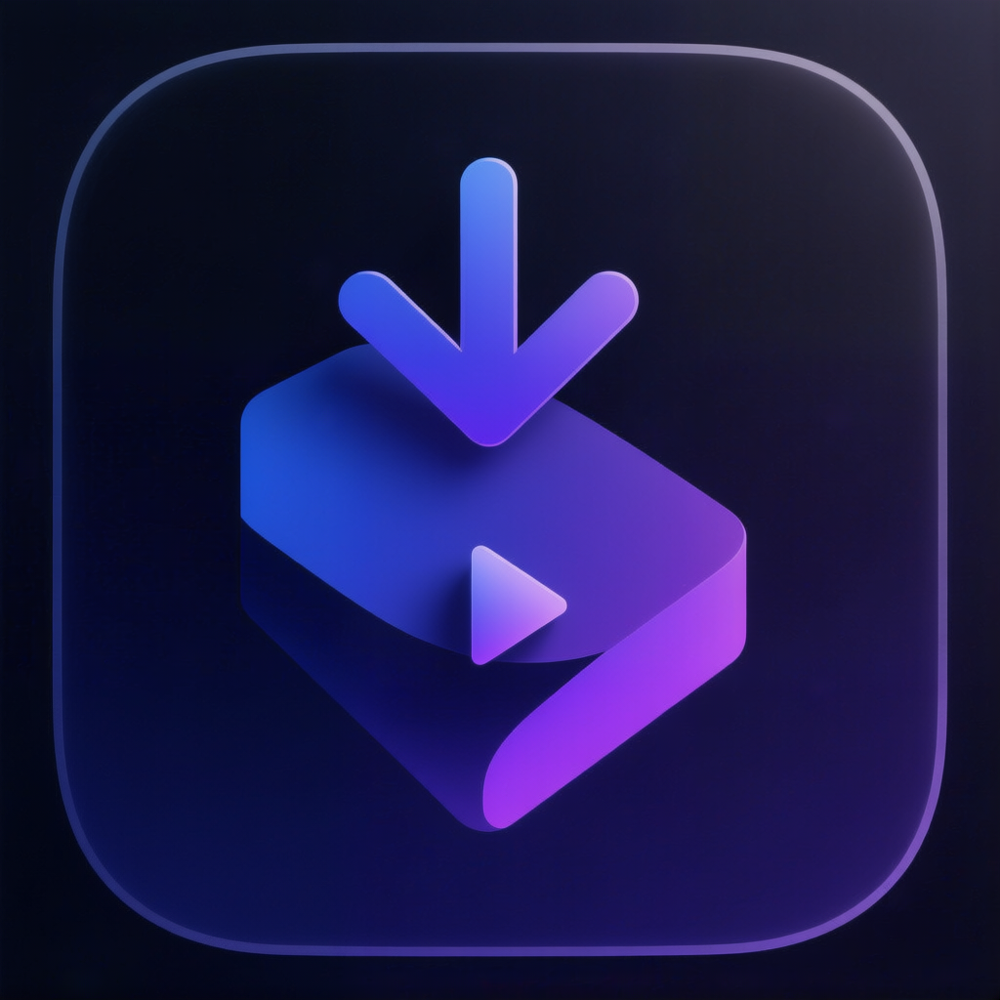

# HiMax

<p align="center">
  
</p>

<p align="center">
  <strong>跨平台视频下载器</strong> — 基于 Electron + yt-dlp + FFmpeg
</p>

<p align="center">
  
  
  
  
</p>

---

## 功能特性

- **多平台支持** — Windows、macOS、Linux 一键下载安装
- **海量网站** — 基于 yt-dlp 引擎，支持 [1000+ 视频/音频网站](https://github.com/yt-dlp/yt-dlp/blob/master/supportedsites.md)
- **播放列表** — 支持解析和批量下载整个播放列表
- **自动管理二进制** — yt-dlp 和 FFmpeg 自动下载、更新，无需手动配置
- **并发下载** — 可调节并发数（1-10），任务队列智能调度
- **质量选择** — 自由选择视频分辨率、格式、字幕
- **文件名模板** — 支持 `{title}` `{author}` `{date}` `{resolution}` `{id}` 等变量
- **Cookie 支持** — 浏览器 Cookie 导出 / 手动导入 cookies.txt，解决需要登录的视频
- **抖音无水印** — 内置自定义 Douyin Extractor，自动获取无水印视频
- **速度限制** — 可设置下载速度上限
- **文件冲突处理** — 自动重命名 / 覆盖 / 跳过
- **暗色 / 亮色主题** — 手动切换，精致 UI
- **中英双语** — 完整 i18n 国际化支持
- **系统托盘** — 最小化到托盘，后台下载
- **快捷键** — 可自定义全局快捷键
- **卸载干净** — 所有数据存放在安装目录内，卸载无残留

## 截图

> *待补充*

## 下载安装

前往 [Releases](../../releases) 页面下载最新版本：

| 平台 | 格式 | 说明 |
|------|------|------|
| Windows | `.exe` (NSIS) | 安装版，支持自定义安装目录 |
| Windows | `Portable.exe` | 免安装单文件，双击即用 |
| macOS | `.dmg` | 拖拽安装，支持 Intel + Apple Silicon |
| macOS | `.zip` | 解压即用 |
| Linux | `.AppImage` | 免安装，chmod +x 后运行 |
| Linux | `.deb` | Debian/Ubuntu 安装包 |

## 从源码构建

### 环境要求

- **Node.js** 20+（YouTube 下载需要）
- **npm** 10+
- **Git LFS**（克隆仓库前安装）

### 开发模式

```bash
# 克隆仓库
git lfs install
git clone <repo-url>
cd HiMax

# 安装依赖
npm install

# 启动开发服务器（前端热更新 + Electron）
npm run dev:electron
```

### 打包发布

```bash
# Windows
npm run dist:win          # NSIS 安装版
npm run dist:portable     # 免安装单文件版
npm run dist:win:all      # 两种都打

# macOS（需要在 macOS 环境或 GitHub Actions 上构建）
npm run dist:mac          # 默认双架构
npm run dist:mac:arm64    # 仅 Apple Silicon
npm run dist:mac:x64      # 仅 Intel
npm run dist:mac:universal # Universal Binary

# Linux
npm run dist:linux        # AppImage + deb
```

### CI 自动构建

项目配置了 GitHub Actions（`.github/workflows/build.yml`），推送版本 tag 时自动三平台构建：

```bash
git tag v1.0.0
git push --tags
```

## 项目结构

```
HiMax/
├── electron/                    # Electron 主进程
│   ├── main.cjs                 # 应用入口、窗口管理、托盘
│   ├── preload.cjs              # 上下文隔离桥接
│   ├── ipc-handlers.cjs         # IPC 通信处理
│   └── services/
│       ├── app-paths.cjs        # 统一路径管理
│       ├── binary-manager.cjs   # yt-dlp/FFmpeg 下载管理
│       ├── ytdlp-engine.cjs     # URL 解析 + 下载引擎
│       ├── download-manager.cjs # 任务队列 + 持久化
│       ├── douyin-extractor.cjs # 抖音无水印提取器
│       └── shortcut-manager.cjs # 全局快捷键
├── src/                         # React 前端
│   ├── components/              # UI 组件
│   ├── pages/                   # 页面（首页/下载/设置）
│   ├── store/                   # Zustand 状态管理
│   ├── i18n/                    # 国际化资源
│   ├── types/                   # TypeScript 类型
│   └── App.tsx                  # 应用根组件
├── build/                       # 应用图标资源
├── scripts/                     # 构建辅助脚本
└── docs/                        # 文档
```

## 技术栈

| 层级 | 技术 |
|------|------|
| 框架 | Electron 41 + React 19 + TypeScript 6 |
| 构建 | Vite 8 + electron-builder |
| 样式 | Tailwind CSS 4 |
| 状态 | Zustand 5 |
| 图标 | Lucide React |
| 国际化 | i18next + react-i18next |
| 图表 | Recharts 3 |
| 下载引擎 | yt-dlp + FFmpeg |

## 数据存储

所有应用数据存放在安装目录内的 `appdata/` 子目录，卸载即清理：

```
appdata/
├── bin/              # yt-dlp, ffmpeg, ffprobe
├── data/
│   ├── settings.json # 应用设置
│   └── tasks.json    # 下载任务
├── debug/            # 调试日志（仅开发模式）
└── cookies.txt       # Cookie 文件
```

> **macOS 例外**：由于 `.app` 包是只读的，数据存放在 `~/Library/Application Support/HiMax/`

## 常见问题

### YouTube 提示 "Sign in to confirm you're not a bot"

YouTube 反爬严格，需要使用 Cookie。在设置 → Cookie 中导出浏览器 Cookie 或手动导入 `cookies.txt`。推荐使用 Firefox（不受 Windows DPAPI 限制）。

### Windows Cookie 导出失败

Windows 上 Electron 进程会干扰 DPAPI 解密。解决方案：
1. 关闭浏览器后重试
2. 使用 Firefox（不受影响）
3. 手动导入 cookies.txt

### 抖音视频下载失败

项目内置了自定义抖音提取器（自动 fallback），无需 Cookie 即可获取无水印视频。如果仍然失败，请提交 Issue。

## 开源协议

MIT License
